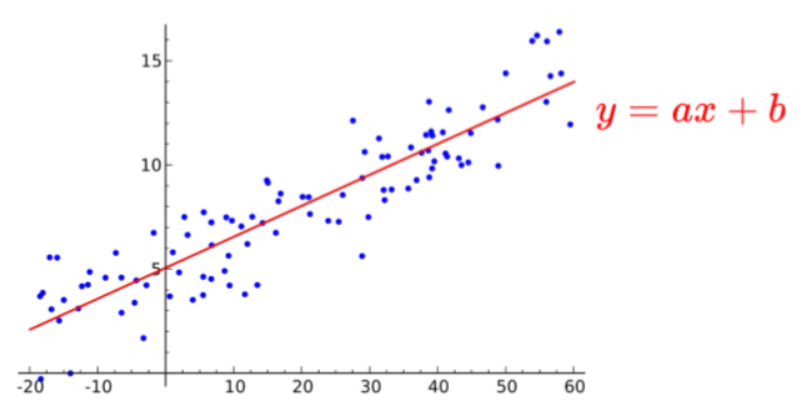
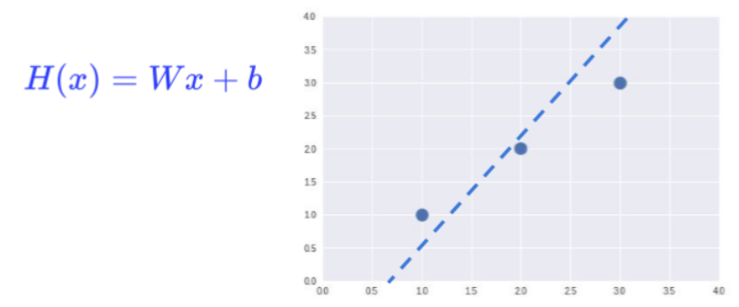
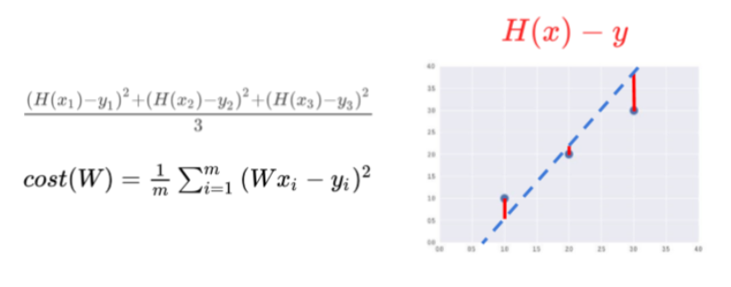
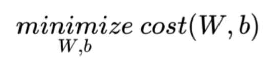
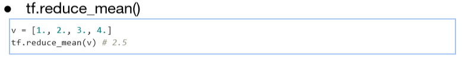
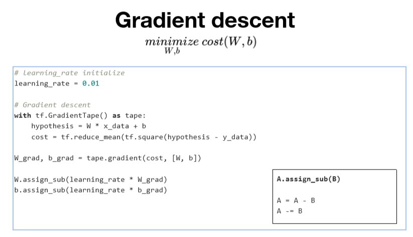
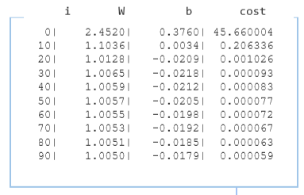
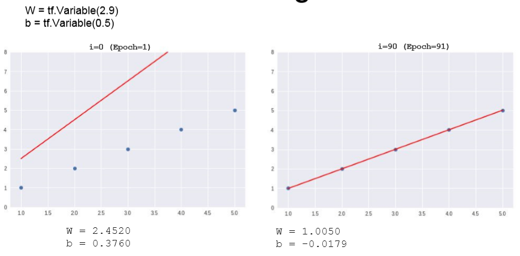
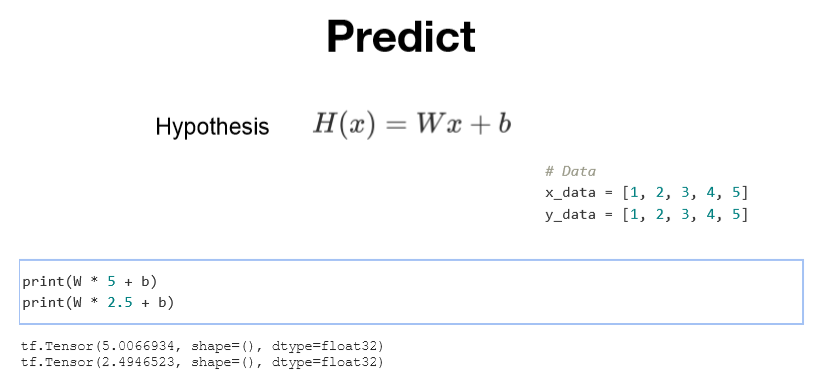

### Lec 02: Simple Linear Regression

---

- Regression 

  - "Regression toward the mean" (Sir Francis Galton)
  - 굉장히 크거나 작은 어떤 데이터는 전체의 평균으로 회귀하려는 특징이 있다.

- Linear Regression : 데이터를 잘 대변하는 직선 방정식을 찾는 것

  

  - 파란 점선이 3점을 잘 대변하고 있는가?

    

  - 이때 직선 방정식과 점들과의 차이를 Cost라고 부르는데, 이 Cost가 작을 수록 잘 대변하고 있는 것이다.

    

  - 식이 어떻게 유도 되는가 생각해보기

  - 우리의 목표 :  Minimize cost

    

------

### Lab 02: Simple Linear Regression 를 TensorFlow 로 구현하기

- Build hypothesis and cost

  

  - reduce : 차원(rank)를 줄인다.

    

  - 경사 하강법/경사 알고리즘

    

    - cost가 최소가 되는 W와 b를 찾는 알고리즘
    - learning_rate : 굉장히 작은 값을 사용함 / 구한 기울기를 얼만큼 반영할 것인가를 결정하는 변수

  - 전체 코드

    ```
    import tensorflow as tf
    
    # tensorflow 즉시 실행 활성화
    tf.enable_eager_execution() 
    
    # Data 
    x_data = [1, 2, 3, 4, 5]
    y_data = [1, 2, 3, 4, 5]
    
    # W, b initialize 
    W = tf.Variable(2.9)
    b = tf.Variable(0.5)
    
    learning_rate = 0.01
    
    for i in range(100+1): # W, b update    
        # Gradient descent   
        with tf.GradientTape() as tape: 
            hypothesis = W * x_data + b   
            cost = tf.reduce_mean(tf.square(hypothesis - y_data))
            W_grad, b_grad = tape.gradient(cost, [W, b]) 
            W.assign_sub(learning_rate * W_grad)  
            b.assign_sub(learning_rate * b_grad)  
            if i % 10 == 0:    
                print("{:5}|{:10.4f}|{:10.4}|{:10.6f}".format(i, W.numpy(), b.numpy(), cost))
    ```

    - Output

      

  - Training

    

  - 훈련된 Hypothesis로 값 예측하기 / 거의 유사하게 나오는 것을 확인할 수 있음

    