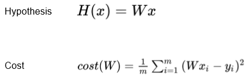
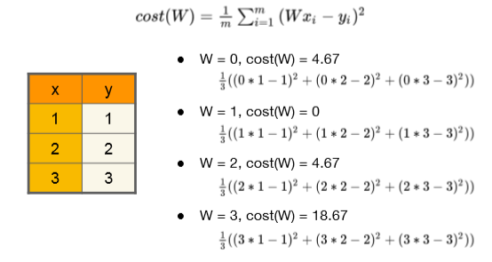
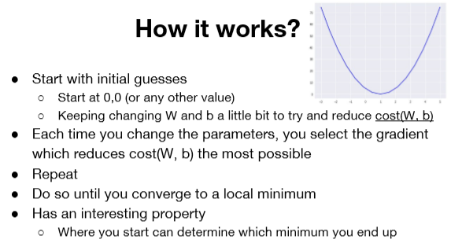
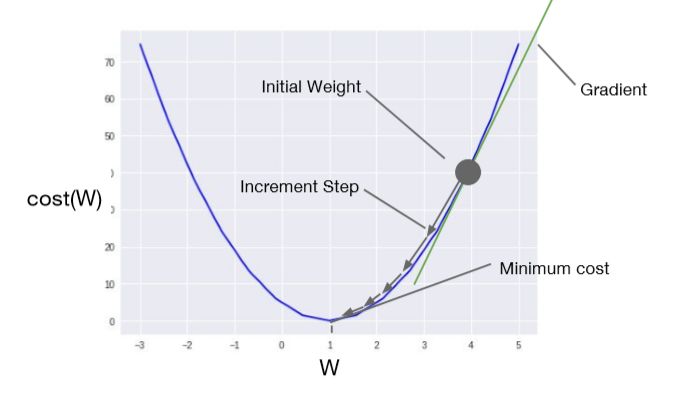
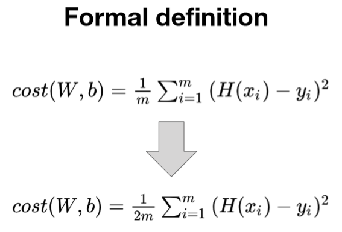
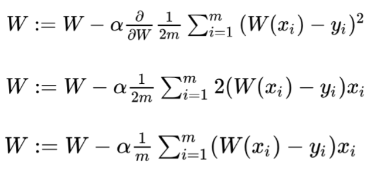
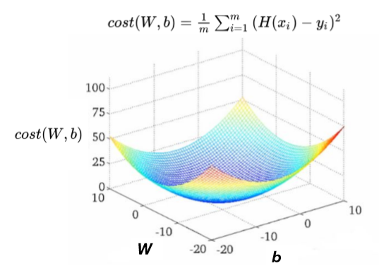
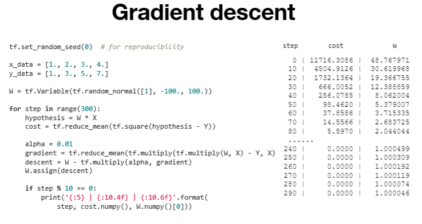

### Lec 03: Linear Regression and How to minimize cost

---

- 기존의 Hypothesis와 Cost를 간략화

  

- Hypothesis에 따른 cost 변화

  

- Gradient descent algorithm 동작 과정

  

  

  - 한 step을 움직일 때, 기울기 비례로 이동한다. 즉 기울기가 가파를 수록 더욱 많이 이동한다.

  - Gradient는 미분으로 구할 때, 간편한 계산을 위한 식 변화 (평균을 구할때 분모의 계수는 몇이여도 상관없는데, 미분했을때 약분되게 하기 위해 2로 설정)

    

  - 미분 과정 (알파 = learning rate)

    

  - Gradient descent 한계점 (다음과 같은 그림에서는 시작점에 따라 최적의 cost를 찾을 수 없다.)

    

  - 다음 그림에서만 가능함

    

---

### Lab 03: Linear Regression and How to minimize cost 를 TensorFlow 로 구현하기

- cost는 0으로 수렴하고, W는 특정 값으로 수렴하는 것을 알 수 있다.

  