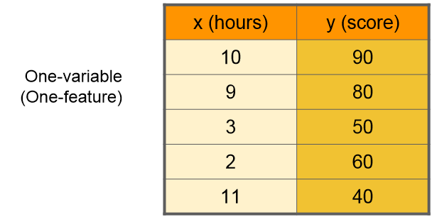
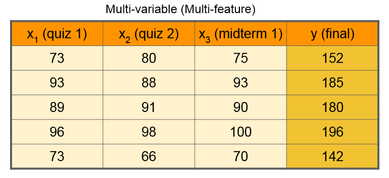
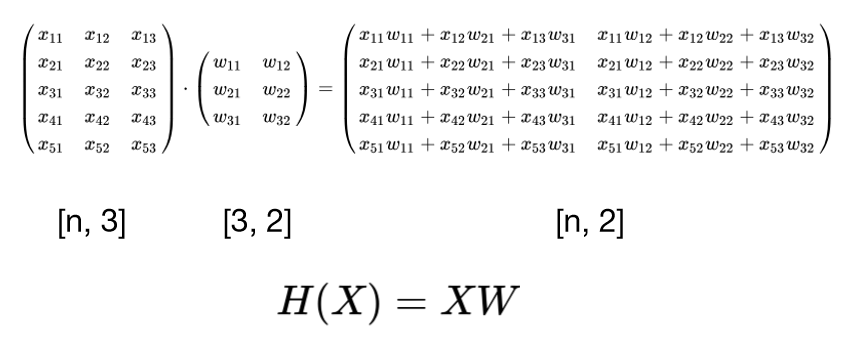
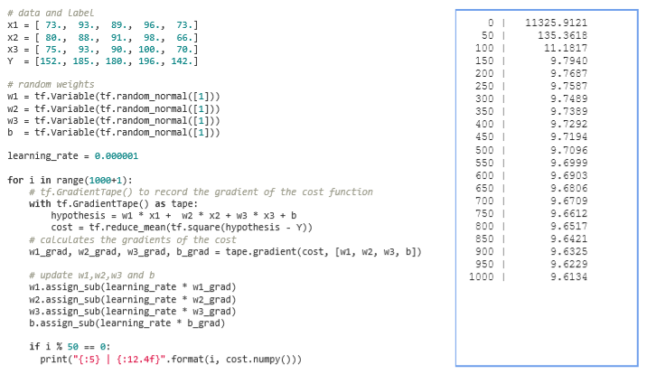
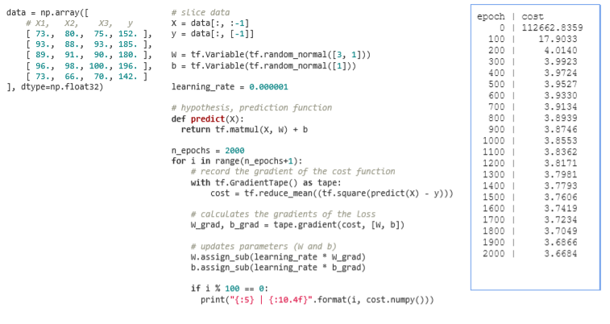
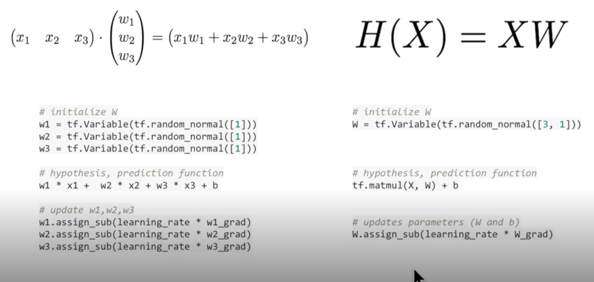

### Lec 04: Multi-variable Linear Regression

---

- 변수가 하나일 때

  

- 변수가 여러개 일때

  

- 변수가 여러개 일 때 Hypothesis

  

- 변수의 간편화를 위한 Dot Product

  

- 행렬을 이용한 Hypothesis

  

- Matrix 사용 이점 : 데이터 개수에 상관없이 동일한 Hypothesis를 이용할 수 있다.

  

---

### Lab 04: Multi-variable Linear Regression 를 TensorFlow 로 구현하기

- 데이터 준비

  

- Gradient Descent Algorithm

  

- numpy를 사용한 구현

  

- Matrix를 사용했을 때의 이점

  

---

