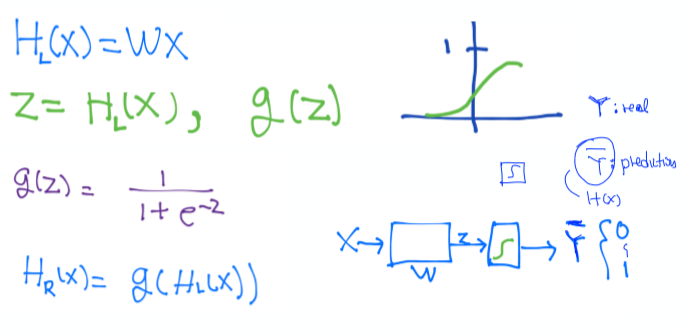

### Lec 06: Softmax Regression: 기본 개념소개

---

- Logistic Regression

  

- Multinomial classification (직선 하나는 그것인지 아닌지만 구분한다)

  

- 행렬곱을 이용하여 Hypothesis를 계산하고, 각 Hypothesis를 각 sigmoid Function에 집어넣는다.

  

  - 계산이 복잡하고 비효율적이다.

- Sigmoid의 결과값을 더했을때, 1이 되도록 한다. -> Softmax

  

- Cross-Entropy (Cost Function)

  

  
  - 두 개가 왜 같은지는 생각해보기

    

---

### Lab 06-1: Softmax classifier 를 TensorFlow 로 구현하기

- 기본 데이터

  

  - one-hot encoding : 특정 값을 행렬로 묘사하는 방법

- Softmax Function : Logistic Classifier된 값을 확률 값으로 바꿔준다.

  

- Cross Entropy : Cost를 계산해주는 Function

  

- Gradient Function : 최적값을 찾아간다.

  

- Train 훈련시키기

  

- 값 예측하기

  

---

### Lab 06-2: Fancy Softmax classifier 를 TensorFlow 로 구현하기

#### 기본 Library 선언 및 Tensorflow 버전 확인

In [1]: 

```
import tensorflow as tf
import numpy as np
tf.enable_eager_execution()
tf.set_random_seed(777)  # for reproducibility
tfe = tf.contrib.eager
```

WARNING: The TensorFlow contrib module will not be included in TensorFlow 2.0.
For more information, please see:
  * https://github.com/tensorflow/community/blob/master/rfcs/20180907-contrib-sunset.md
  * https://github.com/tensorflow/addons
If you depend on functionality not listed there, please file an issue.


In [15]:

```
xy = np.loadtxt('data-04-zoo.csv', delimiter=',', dtype=np.int32) #tf1.13.1에서는 np.int32, 이전에는 np.float32
x_data = xy[:, 0:-1]
y_data = xy[:, [-1]]

nb_classes = 7  # 0 ~ 6

# Make Y data as onehot shape
Y_one_hot = tf.one_hot(list(y_data), nb_classes)
Y_one_hot = tf.reshape(Y_one_hot, [-1, nb_classes])

print(x_data.shape, Y_one_hot.shape)
```

(101, 16) (101, 7)


In [4]:

```
#Weight and bias setting
W = tfe.Variable(tf.random_normal([16, nb_classes]), name='weight')
b = tfe.Variable(tf.random_normal([nb_classes]), name='bias')
variables = [W, b]

# tf.nn.softmax computes softmax activations
# softmax = exp(logits) / reduce_sum(exp(logits), dim)
def logit_fn(X):
    return tf.matmul(X, W) + b

def hypothesis(X):
    return tf.nn.softmax(logit_fn(X))

def cost_fn(X, Y):
    logits = logit_fn(X)
    cost_i = tf.nn.softmax_cross_entropy_with_logits_v2(logits=logits,
                                                           labels=Y)
    cost = tf.reduce_mean(cost_i)
    
    return cost

def grad_fn(X, Y):
    with tf.GradientTape() as tape:
        loss = cost_fn(X, Y)
        grads = tape.gradient(loss, variables)
        return grads
    
def prediction(X, Y):
    pred = tf.argmax(hypothesis(X), 1)
    correct_prediction = tf.equal(pred, tf.argmax(Y, 1))
    accuracy = tf.reduce_mean(tf.cast(correct_prediction, tf.float32))

    return accuracy
```


In [5]:

```
def fit(X, Y, epochs=1000, verbose=100):
    optimizer =  tf.train.GradientDescentOptimizer(learning_rate=0.1)

    for i in range(epochs):
        grads = grad_fn(X, Y)
        optimizer.apply_gradients(zip(grads, variables))
        if (i==0) | ((i+1)%verbose==0):
#             print('Loss at epoch %d: %f' %(i+1, cost_fn(X, Y).numpy()))
            acc = prediction(X, Y).numpy()
            loss = cost_fn(X, Y).numpy() 
            print('Steps: {} Loss: {}, Acc: {}'.format(i+1, loss, acc))

fit(x_data, Y_one_hot)
```

Steps: 1 Loss: 3.635028839111328, Acc: 0.1683168262243271
Steps: 100 Loss: 0.5194157958030701, Acc: 0.7920792102813721
Steps: 200 Loss: 0.31850090622901917, Acc: 0.9108911156654358
Steps: 300 Loss: 0.23534874618053436, Acc: 0.9405940771102905
Steps: 400 Loss: 0.18872138857841492, Acc: 0.9504950642585754
Steps: 500 Loss: 0.158460333943367, Acc: 0.9504950642585754
Steps: 600 Loss: 0.13703754544258118, Acc: 0.9900990128517151
Steps: 700 Loss: 0.1209898293018341, Acc: 0.9900990128517151
Steps: 800 Loss: 0.10847964137792587, Acc: 1.0
Steps: 900 Loss: 0.09843041747808456, Acc: 1.0
Steps: 1000 Loss: 0.09016557037830353, Acc: 1.0

---

