### Lec 12: NN의 꽃 RNN 이야기

---

- Sequence data : 현재 state가 다음 state에 영향을 미친다

  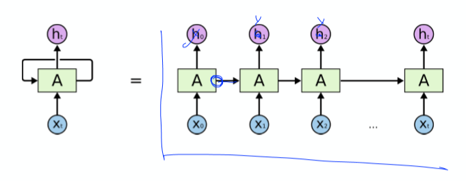

- Recurrent Neural Network

  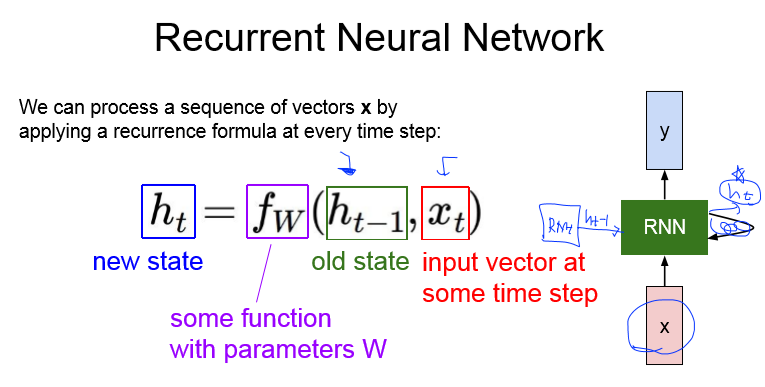

- hello 데이터를 받았을 때,

  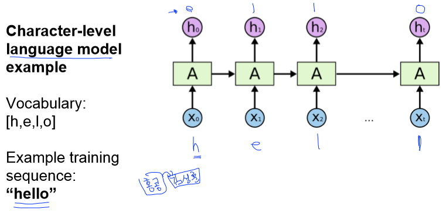

- one-hot Encoding으로 벡터화

  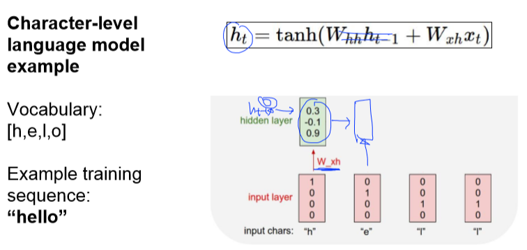

- Softmax를 이용한 결과 추론 

  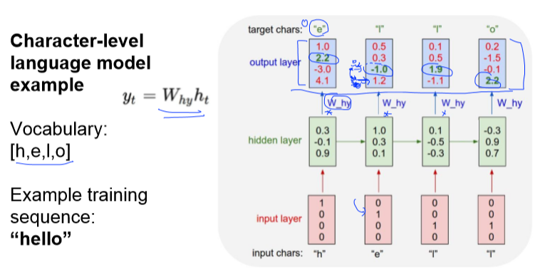

-  RNN 활용

  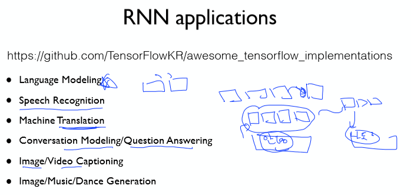

  - Language Modeling : 연관 검색어
  - Speech Recognition 
  - Maching Translation : 번역 
  - Conversation Modeling/Question Answering : 챗봇
  - Image/Video Captioning 
  - Image/Music/Dance Generation :

- 복잡한 RNN 처리 : LSTM, GRU

---

### Lab 12-0 rnn basics

- keras를 활용한 RNN 구현

  - 1번째 방법

    ```
    cell = layers.SimpleRNNCell(units=hidden_size) rnn = layers.RNN(cell, return_sequences=True, return_state=True)
    outputs, states = rnn(x_data)
    ```

  - 2번째 방법

    ```
    rnn = layers.SimpleRNN(units=hidden_size, return_sequences=True, return_state=True) 
    outputs, states = rnn(x_data)
    ```

  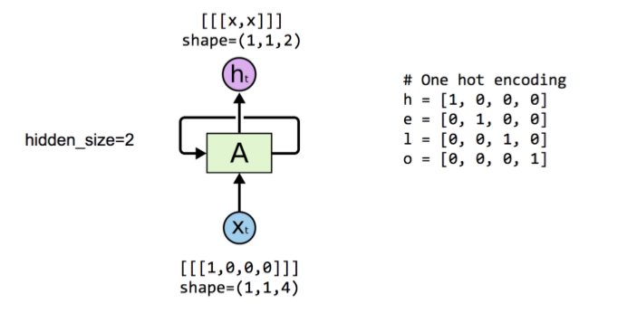

  - input에서 shape([batch size], [sequance length], [input demension])

---

### Lab 12-1 many to one (word sentiment classification)

- many to one : 자연어 처리에서 많이 씀

  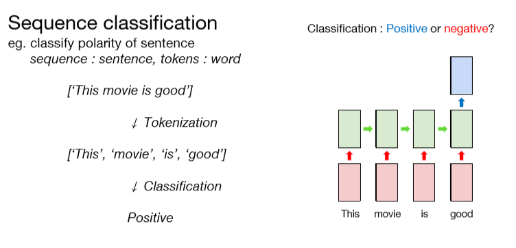

  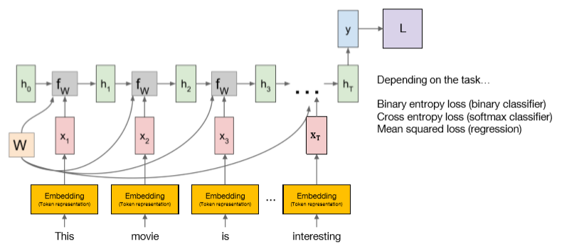

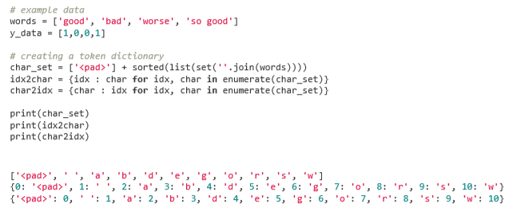

- token을 integer로 맵핑하는 token dictionary
- 각각의 시퀀스의 길이가 다르기 때문에 ['<pad>']라는 헤더를 달아줌
- 딥러닝은 배치단위 연산이 효율적임
- 1 : 긍정, 0 : 부정

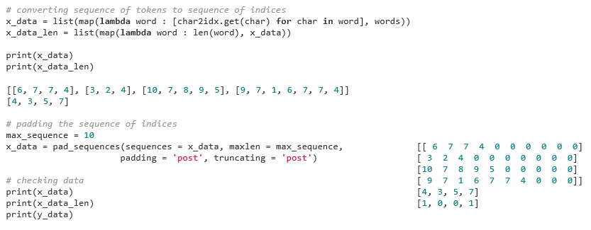

- max_sequence에 맞춰 '0'으로 padding 된 것을 확인 할 수 있음

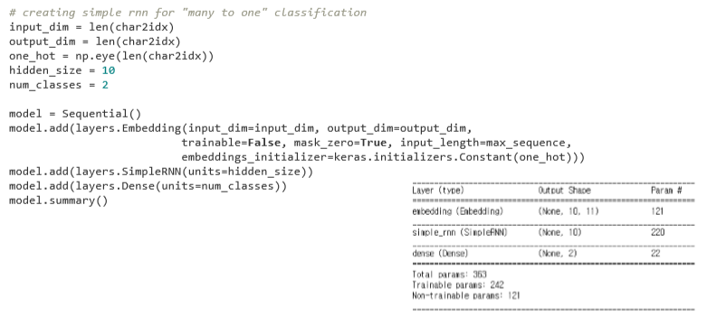

- 전처리 : Embedding
  1. mask_zero : 전처리 단계에서 '0'으로 처리된 부분을 연산에서 제외
  2. trainable : one-hot 벡터를 트레이닝 하지 않음

- SimpleRNN : 기본적으로 시퀀스의 마지막 토큰을 받아, 처리한 결과 리턴
- Dense : RNN을 Dense로 활용하도록 함

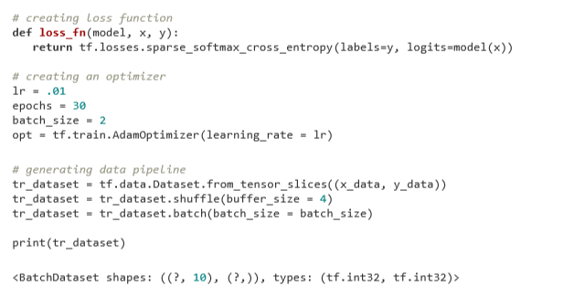

- cross_entropy를 이용하여 loss를 계산함

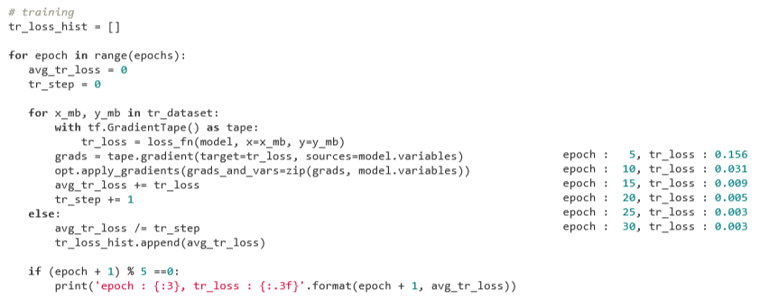

- 성능 확인

  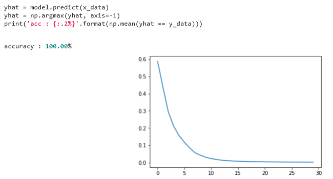

---

### Lab 12-2 many to one stacking

- Multi-layed RNN, Stacked RNN

  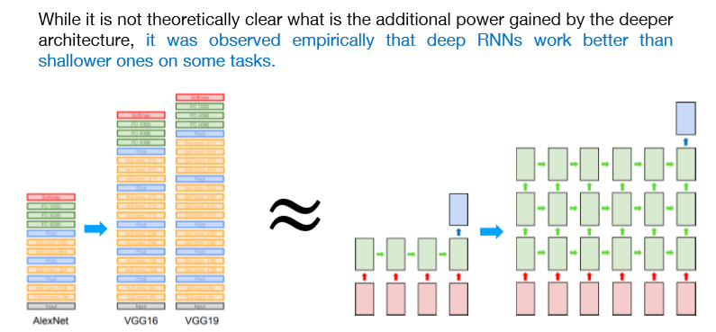

---

### Lab 12-3 many to many

- 형태소 분석에 쓰임

  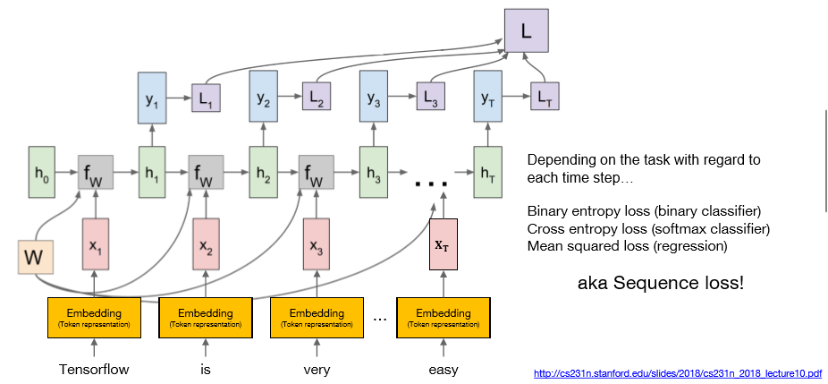

  - Sequence loss를 백프로포게이션(?)으로 학습할 수 있다.

---

### Lab 12-4 many to many bidirectional

- bidirectional : 양방향으로 활용

  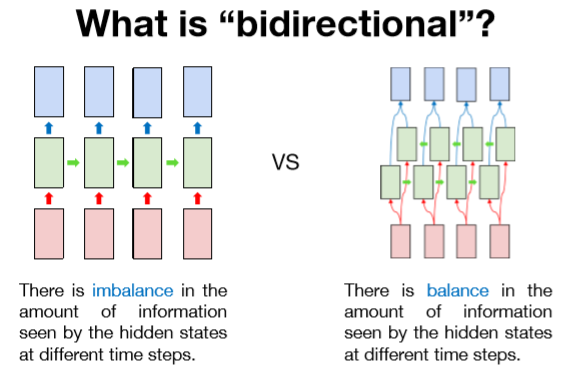
  - forward RNN : hidden state가 가지고 있는 정보가 순차적
  - backward RNN :  forward RNN과 역순

- 활용 과정

  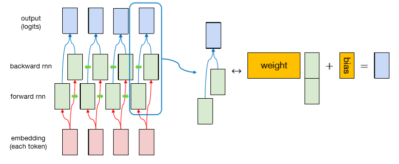

  - forward와 backward hidden state의 정보를 컨키네이트(?)하는 방식으로 합치고 weight와 bias를 이용하여 값을 추출해낸다.
  - weight와 bias는 모든 데이터에서 동일하게 사용한다.
  - 구현은 12-3과 동일하지만, 함수 호출 중 bidirectional만 추가하면 됨

---

### Seq2Seq (Chat bot에서 활용)

- Seq2Seq : Sequence의 데이터를 받고 Sequence의 데이터를 반환하는 것

  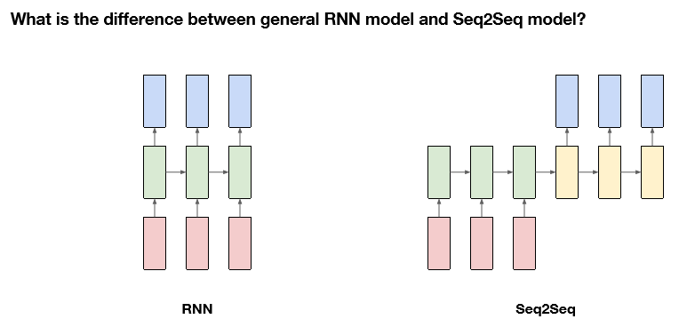

- Example : Chatbot

  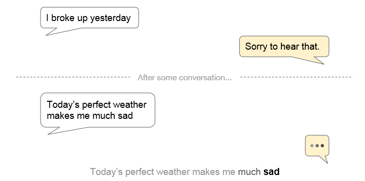

- 대표적인 활용 사례

  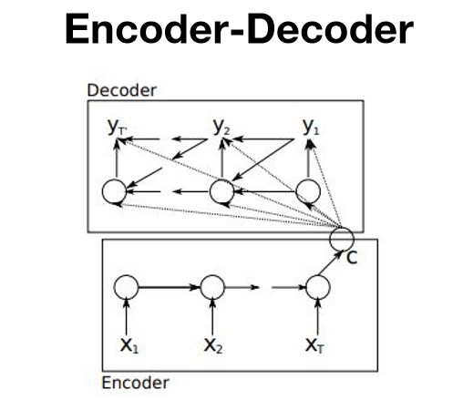

  - input : 하나의 단어
  - c : RNN의 마지막 Hidden state 데이터 값 (Encoder 요약 값)
  - decoder : 각 스텝의 출력값이 다음 스텝의 입력값에 사용된다.

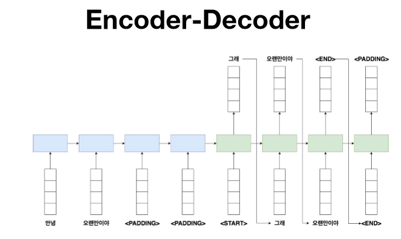

- 파란색 : Encoder / 초록색 : Decoder

### Chatbot 구현

1. sources를 targets으로 번역하는 dataset

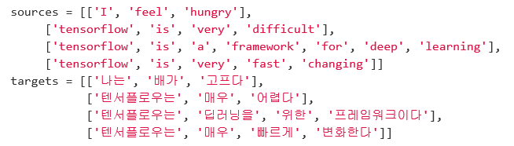

2. Vocab Dict : 각각의 데이터를 integer로 맵핑

   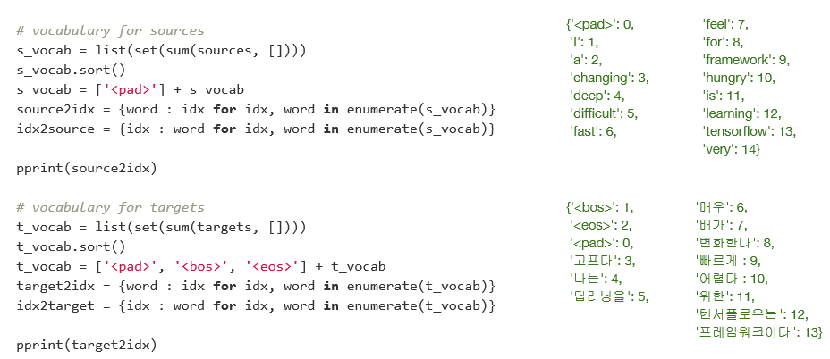

   - bos : 시작 토큰 / eos : 종료 토큰

3. 전처리 함수

   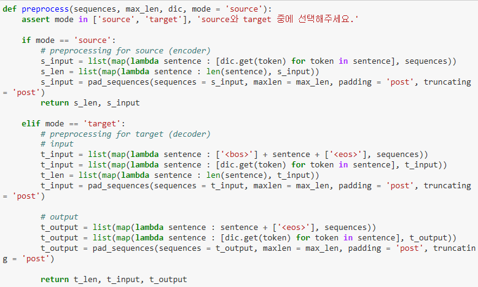

   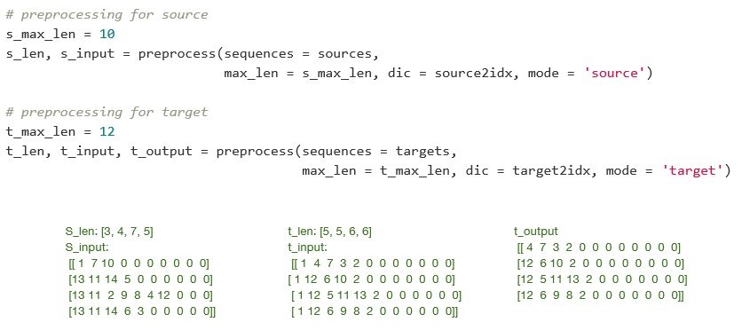

4. suffle과 batch를 통해서 각 데이터를 설정해준다. 각 데이터는 시퀀스에 맞게 준비가 된다.

   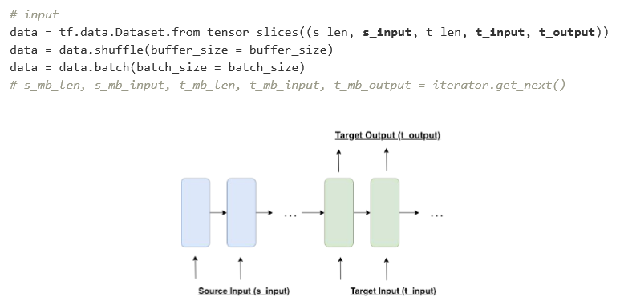

5. 인코더와 디코더의 기반이 되는 GRU 알고리즘 활용하는 알고리즘

   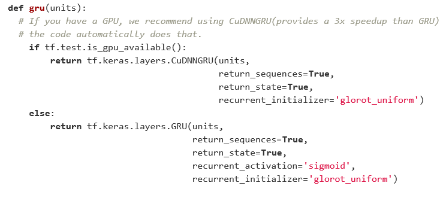

   - CuDNNGRU : 랜덤값이 너무 작거나 크게 초기화되는 것을 방지해줌

6. 인코더 구현

   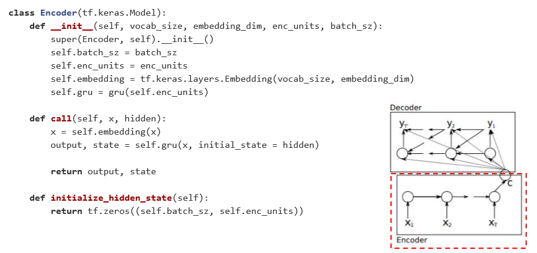

7. 디코더 구현

   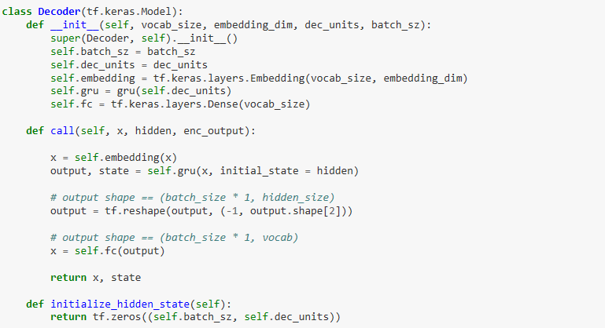

8. Loss & Optimizer

   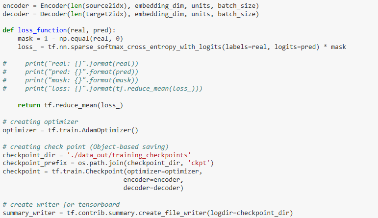

9. Training

   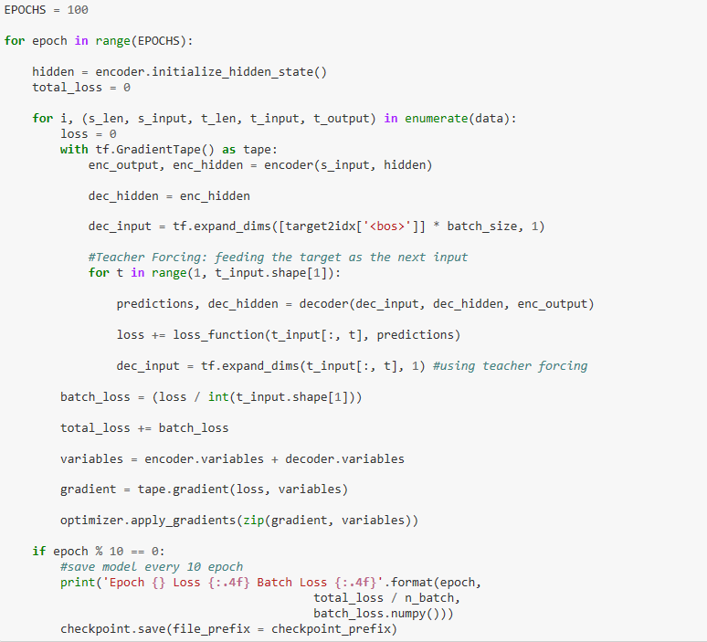

   - 티처 포싱은 다음장에

   - Training (Teacher Forcing)

     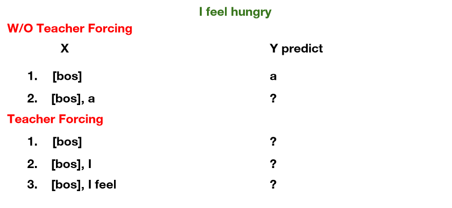

     - 어렵다... 근데 중요한 듯!!

   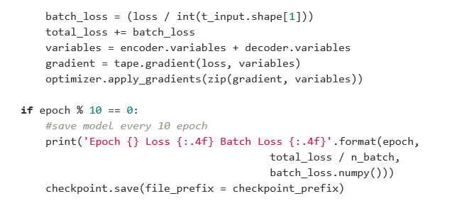

   - 예측

     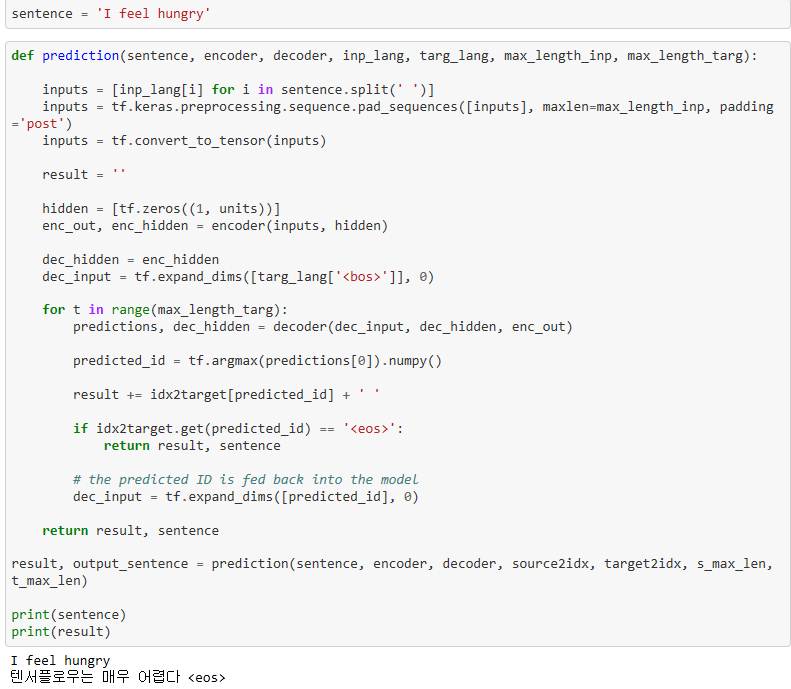

---

### Lab12-6: Seq2Seq Attention

- 기존 Seq2Seq의 문제점

  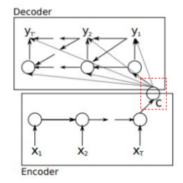

  - 한개의 벡터값을 활용하는 것은 성능이 떨어진다.

- 모든 정보를 기억하지않고, 핵심 메세지와 문장만으로 이해한다.

  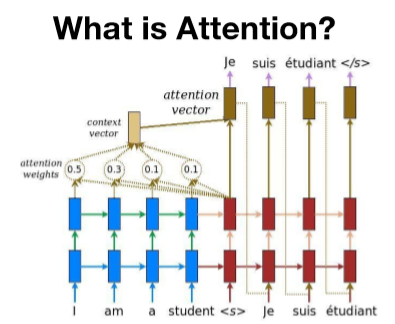

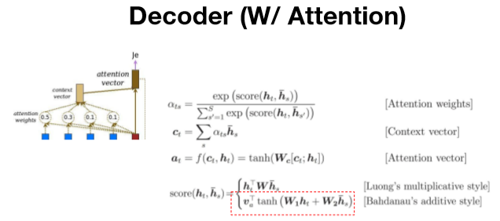

---


 


